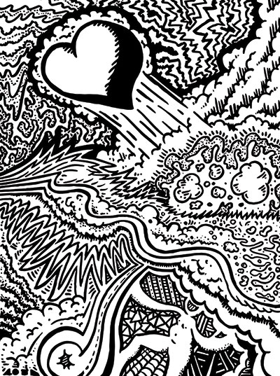

# coloring-book
:art: :pencil2: An open source collection of illustrations I've made for you to color!

|  |  |
|---|---|
| ### [1. Love](pages/1-love.jpg)  | 2. (coming soon) |

## How to use

1. Find a page you want to color by browsing the index above, or clone the entire repository to your computer.
2. Click through to the JPG version of the image, and download it by clicking the `raw` button.
3. Print it out.
4. Color and be happy. :smile:

## Show me!

If you colored a page, I'd love to see it! Feel free to add your coloring to the [issue](issues) for your page, or [Tweet me](http://twitter.com/jglovier) with a picture. :heart:

## Why I did this

Adult coloring books are becoming very popular, and I thought it would be nice to offer some pages that anyone could color for free. Also, my kids will love this too. :tada:

## License

The content in this repository (specifically the artwork) is being made available to use freely for personal use. Anyone who wants to can print out the illustrations and color them.

If you'd like to include these in some type of commercial project, or for distribution elsewhere, please [contact me](jglovier+coloring-book@gmail.com) about that.

## Contributing

This project is more of a personal project I'm making freely available for anyone to use and enjoy, than something I'm looking for contributions on. So I'm not really taking contributions for artwork on this repo. However, if you like this idea and want to make your own, feel free to fork this repo and replace my artwork with your own!

If you have ideas for stuff you'd like to see me draw for you to color, that is definitely welcome. I may or may not create your suggestion, but I'm always happy for ideas. Just [open an issue](issues/new) with the suggestion you have!
