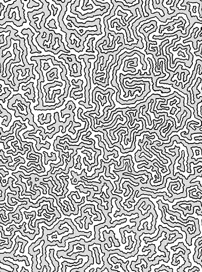

# Coloring Book
:art: :pencil2: An open source collection of illustrations I've made for you to color!

## [Browse the Gallery](https://github.com/jglovier/coloring-book/issues?q=is%3Aissue+is%3Aopen+label%3Agallery)
Check out what people have done with my coloring pages by surfing the [gallery issues here](https://github.com/jglovier/coloring-book/issues?q=is%3Aissue+is%3Aopen+label%3Agallery). Have one of your own to add? Just find the gallery issue for the page you colored, and add your work! Post completed photos, or even your work in progress. :sparkles:

## Download a page to color

Below is are the currently available pages. I'm always working on the next one, so follow this repo, or check back soon.

|   |   |   |
|---|---|---|
| 1. Love ([full res](pages/1-love.jpg)) | 2. Dig ([full res](pages/2-dig.jpg)) | 3. (coming soon) |
|  |  | |

## How to use

1. Find a page you want to color by browsing the index above, or clone the entire repository to your computer.
2. Click through to the JPG version of the image, and download it by clicking the `Download` button.
3. Print it out.
4. Color and be happy. :smile:

## Show me!

If you colored a page, I'd love to see it! Feel free to add your coloring to the [issue](issues) for your page, or [Tweet me](http://twitter.com/jglovier) with a picture. :heart:

## Why I did this

I've found coloring to be a very healthy way to unwind, get out of my head, and into a creative imagining space. It's something I've enjoyed doing since I was a kid, so it brings back positive childhood elements. And it's an activity I can share with my own kids.

Adult coloring books have become very popular, and I'm sure there are plenty of free pages you can print just from a Google search, so there's no lack of things to color in the world. But I think it's fun to make my own things to color, so I thought I'd share them with you too! 💛

## License

The content in this repository (specifically the artwork) is being made available to use freely for personal use. Anyone who wants to can print out the illustrations and color them.

If you'd like to include these in some type of commercial project, or for distribution elsewhere, please [contact me](jglovier+coloring-book@gmail.com) about that.

## Contributing

This project is more of a personal project I'm making freely available for anyone to use and enjoy, than something I'm looking for contributions on. So I'm not really taking contributions for artwork on this repo. However, if you like this idea and want to make your own, feel free to fork this repo and replace my artwork with your own!

If you have ideas for stuff you'd like to see me draw for you to color, that is definitely welcome. I may or may not create your suggestion, but I'm always happy for ideas. Just [open an issue](issues/new) with the suggestion you have!
